# Architecture map

<!-- Generated by scripts/gen_architecture.py; do not edit. Regenerate: python scripts/gen_architecture.py -->

Generated from the code: Python imports (`ast`), TypeScript imports, launchers and skill packages. Companion to [ARCHITECTURE.md](ARCHITECTURE.md) (design, guarantees).
200 files, 485 import/delegation edges.

## 1. How the project works

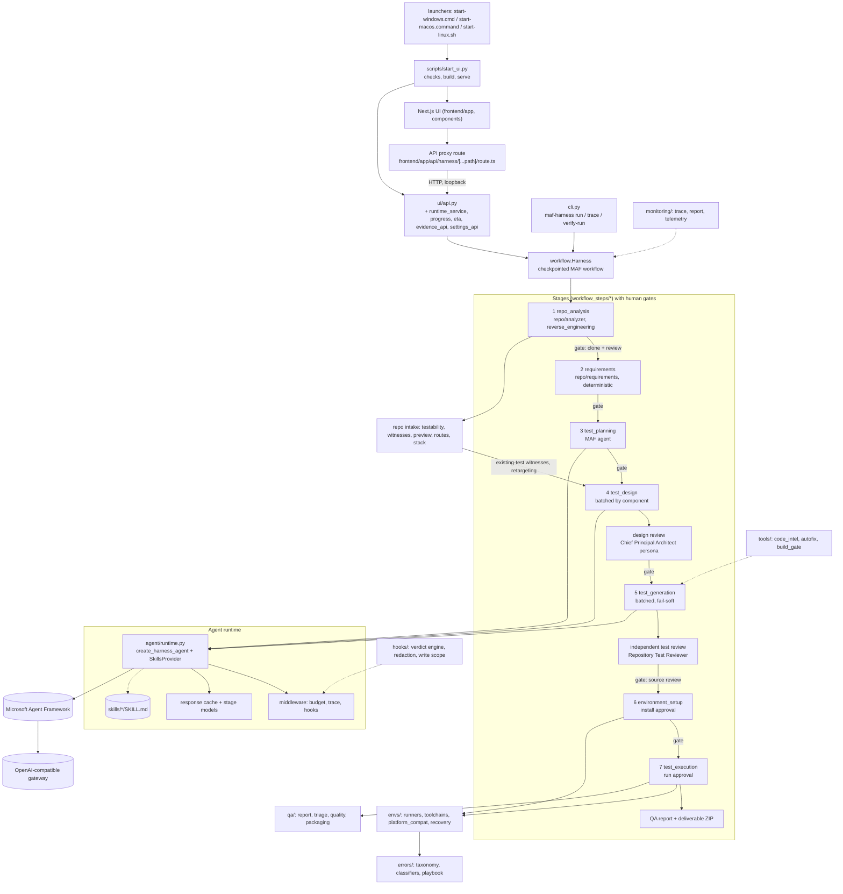
```mermaid
flowchart TD
  L["launchers: start-windows.cmd / start-macos.command / start-linux.sh"] --> SU["scripts/start_ui.py<br/>checks, build, serve"]
  SU --> NX["Next.js UI (frontend/app, components)"]
  SU --> API
  NX --> PX["API proxy route<br/>frontend/app/api/harness/[...path]/route.ts"]
  PX -->|HTTP, loopback| API["ui/api.py<br/>+ runtime_service, progress, eta, evidence_api, settings_api"]
  CLI["cli.py<br/>maf-harness run / trace / verify-run"] --> H
  API --> H["workflow.Harness<br/>checkpointed MAF workflow"]
  H --> S1
  subgraph PIPE["Stages (workflow_steps/*) with human gates"]
    S1["1 repo_analysis<br/>repo/analyzer, reverse_engineering"] -->|gate: clone + review| S2["2 requirements<br/>repo/requirements, deterministic"]
    S2 -->|gate| S3["3 test_planning<br/>MAF agent"]
    S3 -->|gate| S4["4 test_design<br/>batched by component"]
    S4 --> DR["design review<br/>Chief Principal Architect persona"]
    DR -->|gate| S5["5 test_generation<br/>batched, fail-soft"]
    S5 --> TR["independent test review<br/>Repository Test Reviewer"]
    TR -->|gate: source review| S6["6 environment_setup<br/>install approval"]
    S6 -->|gate| S7["7 test_execution<br/>run approval"]
    S7 --> QAR["QA report + deliverable ZIP"]
  end
  subgraph RT["Agent runtime"]
    AR["agent/runtime.py<br/>create_harness_agent + SkillsProvider"]
    MW["middleware: budget, trace, hooks"]
    RC["response cache + stage models"]
    SK[("skills/*/SKILL.md")]
  end
  S3 --> AR
  S4 --> AR
  S5 --> AR
  AR --> MW
  AR --> RC
  AR -.-> SK
  AR --> MAF[("Microsoft Agent Framework")]
  MAF --> GW[("OpenAI-compatible gateway")]
  HK["hooks/: verdict engine, redaction, write scope"] -.-> MW
  S1 --> RI["repo intake: testability, witnesses, preview, routes, stack"]
  RI -->|existing-test witnesses, retargeting| S4
  S6 --> ENV["envs/: runners, toolchains, platform_compat, recovery"]
  S7 --> ENV
  ENV --> ERR["errors/: taxonomy, classifiers, playbook"]
  S7 --> QAP["qa/: report, triage, quality, packaging"]
  TOOLS["tools/: code_intel, autofix, build_gate"] -.-> S5
  MON["monitoring/: trace, report, telemetry"] -.-> H
```

## 2. Package graph

Nodes are packages; edge labels count file-level import edges.

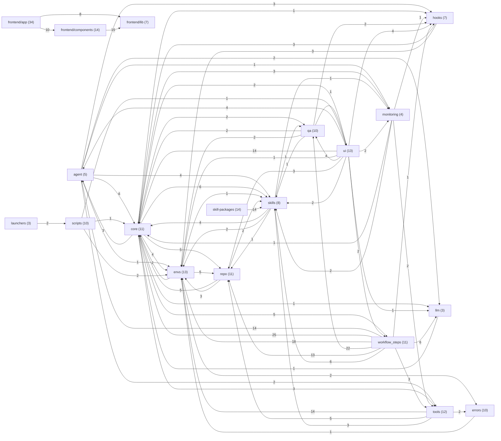
```mermaid
flowchart LR
  g0["agent (5)"]
  g1["core (11)"]
  g2["envs (13)"]
  g3["errors (10)"]
  g4["frontend/app (34)"]
  g5["frontend/components (14)"]
  g6["frontend/lib (7)"]
  g7["hooks (7)"]
  g8["launchers (3)"]
  g9["llm (3)"]
  g10["monitoring (4)"]
  g11["qa (10)"]
  g12["repo (11)"]
  g13["scripts (10)"]
  g14["skill-packages (14)"]
  g15["skills (8)"]
  g16["tools (12)"]
  g17["ui (13)"]
  g18["workflow_steps (11)"]
  g0 -->|6| g1
  g0 -->|1| g2
  g0 -->|3| g7
  g0 -->|2| g9
  g0 -->|1| g10
  g0 -->|4| g15
  g0 -->|2| g16
  g1 -->|3| g0
  g1 -->|4| g2
  g1 -->|1| g7
  g1 -->|1| g9
  g1 -->|3| g10
  g1 -->|2| g11
  g1 -->|5| g12
  g1 -->|6| g15
  g1 -->|3| g16
  g1 -->|2| g17
  g1 -->|5| g18
  g2 -->|2| g1
  g2 -->|2| g3
  g2 -->|5| g12
  g2 -->|1| g15
  g3 -->|1| g2
  g4 -->|10| g5
  g4 -->|8| g6
  g5 -->|15| g6
  g7 -->|3| g1
  g7 -->|3| g2
  g8 -->|2| g13
  g9 -->|1| g1
  g10 -->|1| g1
  g10 -->|1| g7
  g10 -->|2| g15
  g10 -->|2| g16
  g11 -->|2| g1
  g11 -->|2| g2
  g11 -->|2| g7
  g11 -->|1| g15
  g11 -->|1| g17
  g12 -->|5| g1
  g12 -->|3| g2
  g12 -->|2| g15
  g13 -->|1| g1
  g13 -->|2| g2
  g13 -->|1| g17
  g14 -->|14| g15
  g15 -->|4| g1
  g15 -->|2| g2
  g15 -->|1| g10
  g15 -->|1| g11
  g15 -->|1| g12
  g16 -->|14| g2
  g16 -->|2| g3
  g16 -->|5| g12
  g16 -->|3| g15
  g17 -->|4| g0
  g17 -->|14| g1
  g17 -->|1| g2
  g17 -->|4| g7
  g17 -->|1| g9
  g17 -->|2| g10
  g17 -->|4| g11
  g17 -->|3| g12
  g17 -->|2| g15
  g17 -->|2| g18
  g18 -->|14| g0
  g18 -->|25| g1
  g18 -->|18| g2
  g18 -->|1| g7
  g18 -->|6| g9
  g18 -->|22| g11
  g18 -->|13| g12
  g18 -->|6| g15
  g18 -->|3| g16
```

## 3. Per-package file graphs

Edges between files of the same package; cross-package links are in the table.

### agent

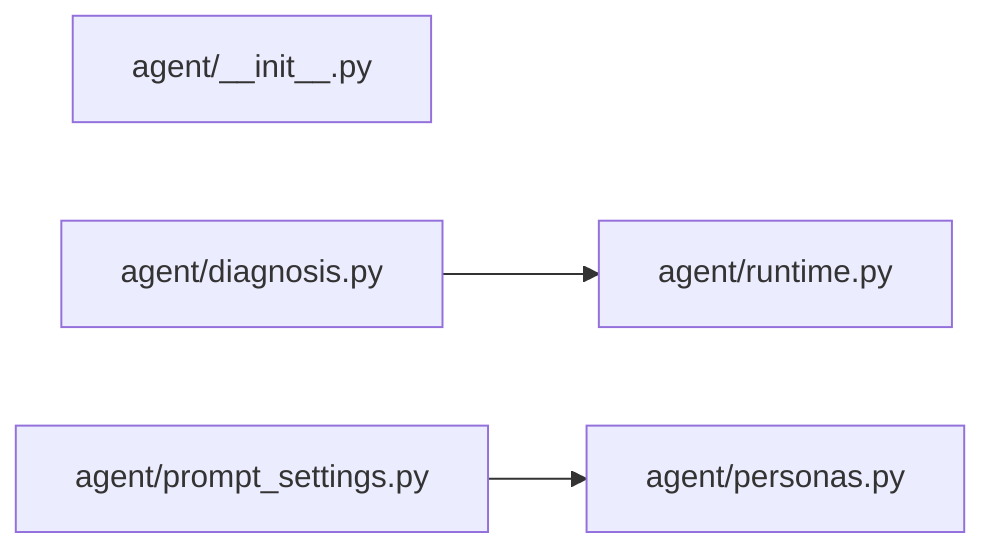
```mermaid
flowchart LR
  f0["agent/__init__.py"]
  f1["agent/diagnosis.py"]
  f2["agent/personas.py"]
  f3["agent/prompt_settings.py"]
  f4["agent/runtime.py"]
  f1 --> f4
  f3 --> f2
```

### core

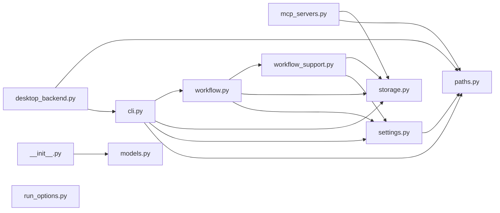
```mermaid
flowchart LR
  f0["__init__.py"]
  f1["cli.py"]
  f2["desktop_backend.py"]
  f3["mcp_servers.py"]
  f4["models.py"]
  f5["paths.py"]
  f6["run_options.py"]
  f7["settings.py"]
  f8["storage.py"]
  f9["workflow.py"]
  f10["workflow_support.py"]
  f0 --> f4
  f1 --> f5
  f1 --> f7
  f1 --> f8
  f1 --> f9
  f2 --> f1
  f2 --> f5
  f3 --> f5
  f3 --> f8
  f7 --> f5
  f9 --> f7
  f9 --> f8
  f9 --> f10
  f10 --> f7
  f10 --> f8
```

### envs

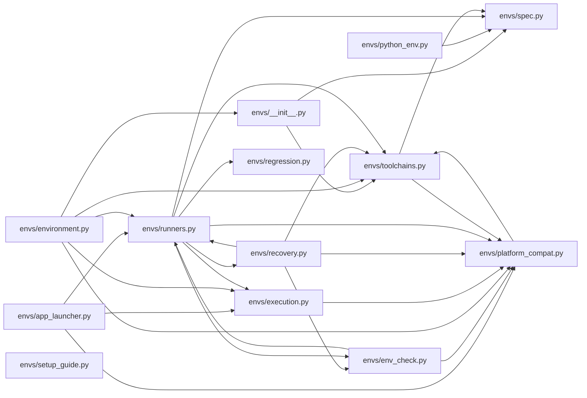
```mermaid
flowchart LR
  f0["envs/__init__.py"]
  f1["envs/app_launcher.py"]
  f2["envs/env_check.py"]
  f3["envs/environment.py"]
  f4["envs/execution.py"]
  f5["envs/platform_compat.py"]
  f6["envs/python_env.py"]
  f7["envs/recovery.py"]
  f8["envs/regression.py"]
  f9["envs/runners.py"]
  f10["envs/setup_guide.py"]
  f11["envs/spec.py"]
  f12["envs/toolchains.py"]
  f0 --> f11
  f0 --> f12
  f1 --> f4
  f1 --> f5
  f1 --> f9
  f2 --> f5
  f2 --> f9
  f3 --> f0
  f3 --> f4
  f3 --> f5
  f3 --> f9
  f3 --> f12
  f4 --> f5
  f5 --> f12
  f6 --> f11
  f7 --> f2
  f7 --> f5
  f7 --> f9
  f7 --> f12
  f9 --> f2
  f9 --> f4
  f9 --> f5
  f9 --> f7
  f9 --> f8
  f9 --> f11
  f9 --> f12
  f12 --> f5
  f12 --> f11
```

### errors

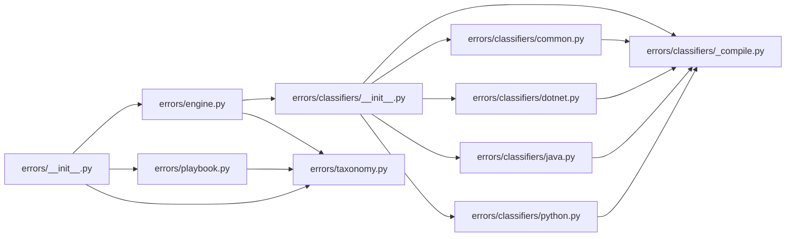
```mermaid
flowchart LR
  f0["errors/__init__.py"]
  f1["errors/classifiers/__init__.py"]
  f2["errors/classifiers/_compile.py"]
  f3["errors/classifiers/common.py"]
  f4["errors/classifiers/dotnet.py"]
  f5["errors/classifiers/java.py"]
  f6["errors/classifiers/python.py"]
  f7["errors/engine.py"]
  f8["errors/playbook.py"]
  f9["errors/taxonomy.py"]
  f0 --> f7
  f0 --> f8
  f0 --> f9
  f1 --> f2
  f1 --> f3
  f1 --> f4
  f1 --> f5
  f1 --> f6
  f3 --> f2
  f4 --> f2
  f5 --> f2
  f6 --> f2
  f7 --> f1
  f7 --> f9
  f8 --> f9
```

### frontend/app

```mermaid
flowchart LR
  f0["frontend/app/(workspace)/layout.tsx"]
  f1["frontend/app/(workspace)/marketplace/layout.tsx"]
  f2["frontend/app/(workspace)/marketplace/mcp/[name]/page.tsx"]
  f3["frontend/app/(workspace)/marketplace/mcp/new/page.tsx"]
  f4["frontend/app/(workspace)/marketplace/mcp/page.tsx"]
  f5["frontend/app/(workspace)/marketplace/skills/[name]/page.tsx"]
  f6["frontend/app/(workspace)/marketplace/skills/page.tsx"]
  f7["frontend/app/(workspace)/prompts/page.tsx"]
  f8["frontend/app/(workspace)/runs/[id]/artifacts/[stage]/[section]/page.tsx"]
  f9["frontend/app/(workspace)/runs/[id]/artifacts/[stage]/page.tsx"]
  f10["frontend/app/(workspace)/runs/[id]/artifacts/page.tsx"]
  f11["frontend/app/(workspace)/runs/[id]/audit/page.tsx"]
  f12["frontend/app/(workspace)/runs/[id]/errors/page.tsx"]
  f13["frontend/app/(workspace)/runs/[id]/evidence/page.tsx"]
  f14["frontend/app/(workspace)/runs/[id]/layout.tsx"]
  f15["frontend/app/(workspace)/runs/[id]/logs/[fileId]/page.tsx"]
  f16["frontend/app/(workspace)/runs/[id]/logs/page.tsx"]
  f17["frontend/app/(workspace)/runs/[id]/observability/page.tsx"]
  f18["frontend/app/(workspace)/runs/[id]/page.tsx"]
  f19["frontend/app/(workspace)/runs/[id]/prompts/page.tsx"]
  f20["frontend/app/(workspace)/runs/[id]/qa/page.tsx"]
  f21["frontend/app/(workspace)/runs/[id]/qa/steps/[step]/page.tsx"]
  f22["frontend/app/(workspace)/runs/[id]/records/[kind]/[recordId]/page.tsx"]
  f23["frontend/app/(workspace)/runs/[id]/tests/[file]/page.tsx"]
  f24["frontend/app/(workspace)/runs/[id]/tests/page.tsx"]
  f25["frontend/app/(workspace)/runs/new/page.tsx"]
  f26["frontend/app/(workspace)/runs/page.tsx"]
  f27["frontend/app/(workspace)/settings/page.tsx"]
  f28["frontend/app/api/harness/[...path]/route.ts"]
  f29["frontend/app/api/harness/report/[token]/[...path]/route.ts"]
  f30["frontend/app/api/report-token/[runId]/route.ts"]
  f31["frontend/app/api/session/route.ts"]
  f32["frontend/app/layout.tsx"]
  f33["frontend/app/page.tsx"]
```

### frontend/components

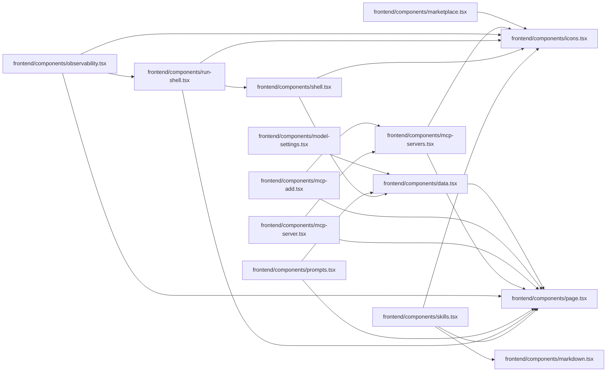
```mermaid
flowchart LR
  f0["frontend/components/data.tsx"]
  f1["frontend/components/icons.tsx"]
  f2["frontend/components/markdown.tsx"]
  f3["frontend/components/marketplace.tsx"]
  f4["frontend/components/mcp-add.tsx"]
  f5["frontend/components/mcp-server.tsx"]
  f6["frontend/components/mcp-servers.tsx"]
  f7["frontend/components/model-settings.tsx"]
  f8["frontend/components/observability.tsx"]
  f9["frontend/components/page.tsx"]
  f10["frontend/components/prompts.tsx"]
  f11["frontend/components/run-shell.tsx"]
  f12["frontend/components/shell.tsx"]
  f13["frontend/components/skills.tsx"]
  f0 --> f9
  f3 --> f1
  f4 --> f6
  f4 --> f9
  f5 --> f6
  f5 --> f9
  f6 --> f1
  f6 --> f9
  f7 --> f0
  f8 --> f1
  f8 --> f9
  f8 --> f11
  f10 --> f0
  f10 --> f9
  f11 --> f1
  f11 --> f9
  f11 --> f12
  f12 --> f0
  f12 --> f1
  f13 --> f1
  f13 --> f2
  f13 --> f9
```

### frontend/lib

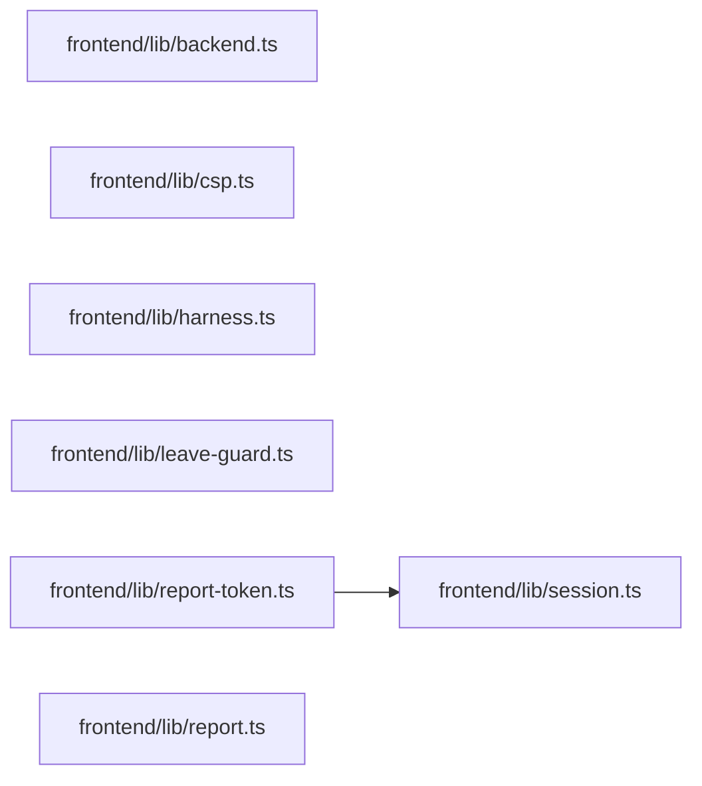
```mermaid
flowchart LR
  f0["frontend/lib/backend.ts"]
  f1["frontend/lib/csp.ts"]
  f2["frontend/lib/harness.ts"]
  f3["frontend/lib/leave-guard.ts"]
  f4["frontend/lib/report-token.ts"]
  f5["frontend/lib/report.ts"]
  f6["frontend/lib/session.ts"]
  f4 --> f6
```

### hooks

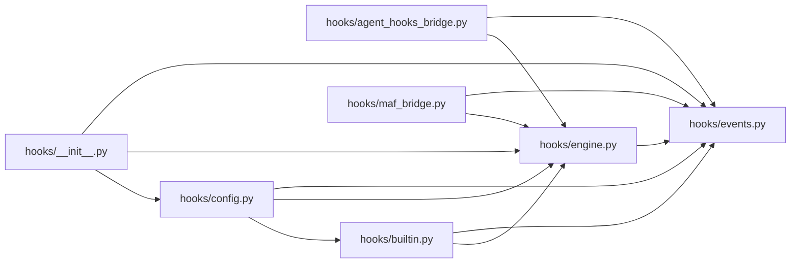
```mermaid
flowchart LR
  f0["hooks/__init__.py"]
  f1["hooks/agent_hooks_bridge.py"]
  f2["hooks/builtin.py"]
  f3["hooks/config.py"]
  f4["hooks/engine.py"]
  f5["hooks/events.py"]
  f6["hooks/maf_bridge.py"]
  f0 --> f3
  f0 --> f4
  f0 --> f5
  f1 --> f4
  f1 --> f5
  f2 --> f4
  f2 --> f5
  f3 --> f2
  f3 --> f4
  f3 --> f5
  f4 --> f5
  f6 --> f4
  f6 --> f5
```

### launchers

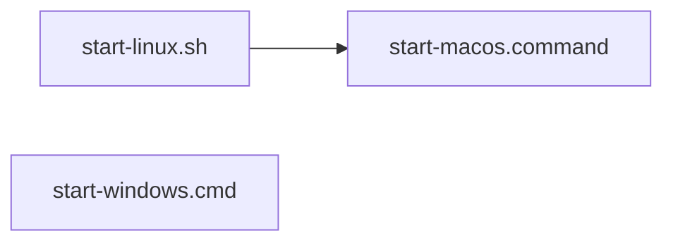
```mermaid
flowchart LR
  f0["start-linux.sh"]
  f1["start-macos.command"]
  f2["start-windows.cmd"]
  f0 --> f1
```

### llm

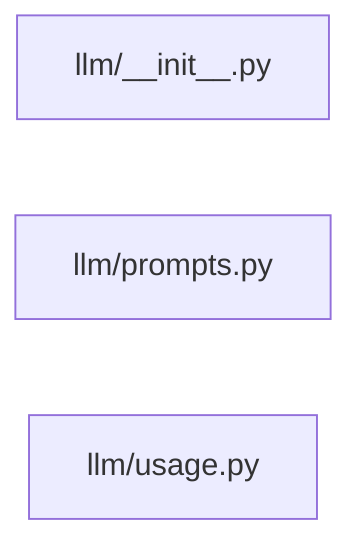
```mermaid
flowchart LR
  f0["llm/__init__.py"]
  f1["llm/prompts.py"]
  f2["llm/usage.py"]
```

### monitoring

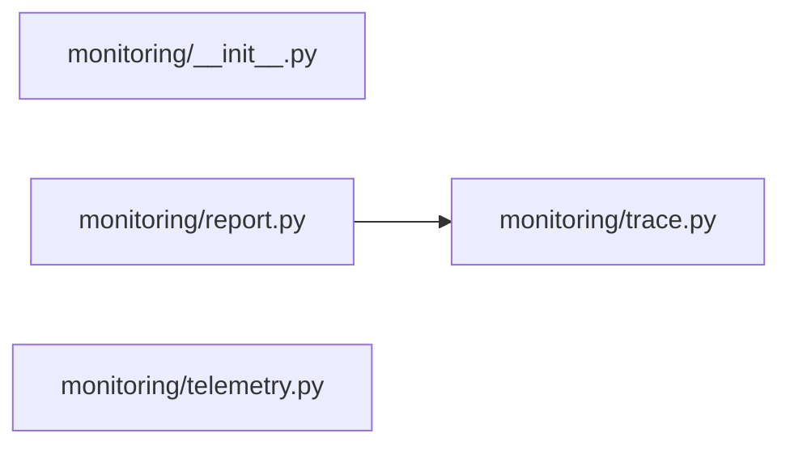
```mermaid
flowchart LR
  f0["monitoring/__init__.py"]
  f1["monitoring/report.py"]
  f2["monitoring/telemetry.py"]
  f3["monitoring/trace.py"]
  f1 --> f3
```

### qa

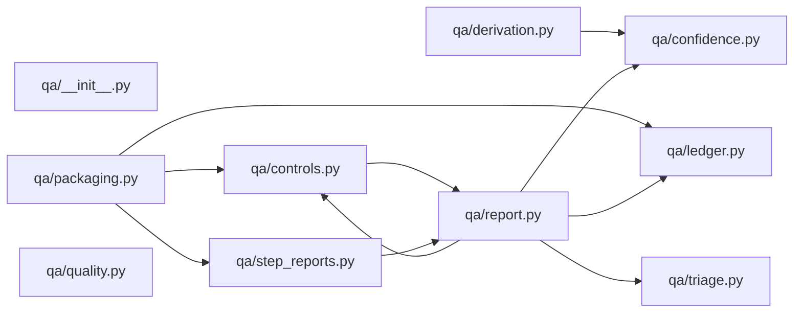
```mermaid
flowchart LR
  f0["qa/__init__.py"]
  f1["qa/confidence.py"]
  f2["qa/controls.py"]
  f3["qa/derivation.py"]
  f4["qa/ledger.py"]
  f5["qa/packaging.py"]
  f6["qa/quality.py"]
  f7["qa/report.py"]
  f8["qa/step_reports.py"]
  f9["qa/triage.py"]
  f2 --> f7
  f3 --> f1
  f5 --> f2
  f5 --> f4
  f5 --> f8
  f7 --> f1
  f7 --> f2
  f7 --> f4
  f7 --> f9
  f8 --> f7
```

### repo

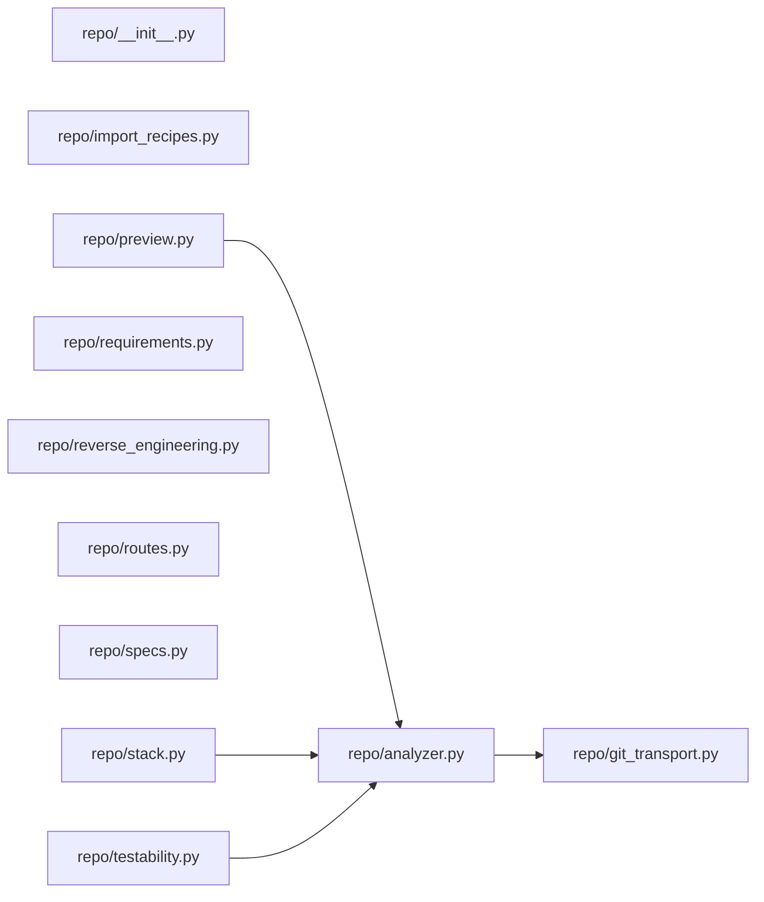
```mermaid
flowchart LR
  f0["repo/__init__.py"]
  f1["repo/analyzer.py"]
  f2["repo/git_transport.py"]
  f3["repo/import_recipes.py"]
  f4["repo/preview.py"]
  f5["repo/requirements.py"]
  f6["repo/reverse_engineering.py"]
  f7["repo/routes.py"]
  f8["repo/specs.py"]
  f9["repo/stack.py"]
  f10["repo/testability.py"]
  f1 --> f2
  f4 --> f1
  f9 --> f1
  f10 --> f1
```

### scripts

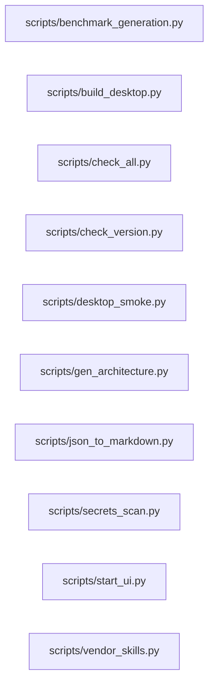
```mermaid
flowchart LR
  f0["scripts/benchmark_generation.py"]
  f1["scripts/build_desktop.py"]
  f2["scripts/check_all.py"]
  f3["scripts/check_version.py"]
  f4["scripts/desktop_smoke.py"]
  f5["scripts/gen_architecture.py"]
  f6["scripts/json_to_markdown.py"]
  f7["scripts/secrets_scan.py"]
  f8["scripts/start_ui.py"]
  f9["scripts/vendor_skills.py"]
```

### skill-packages

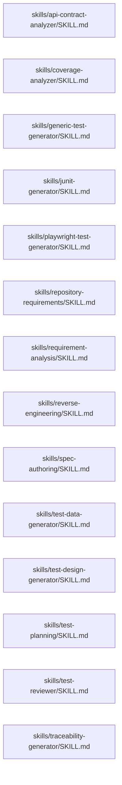
```mermaid
flowchart LR
  f0["skills/api-contract-analyzer/SKILL.md"]
  f1["skills/coverage-analyzer/SKILL.md"]
  f2["skills/generic-test-generator/SKILL.md"]
  f3["skills/junit-generator/SKILL.md"]
  f4["skills/playwright-test-generator/SKILL.md"]
  f5["skills/repository-requirements/SKILL.md"]
  f6["skills/requirement-analysis/SKILL.md"]
  f7["skills/reverse-engineering/SKILL.md"]
  f8["skills/spec-authoring/SKILL.md"]
  f9["skills/test-data-generator/SKILL.md"]
  f10["skills/test-design-generator/SKILL.md"]
  f11["skills/test-planning/SKILL.md"]
  f12["skills/test-reviewer/SKILL.md"]
  f13["skills/traceability-generator/SKILL.md"]
```

### skills

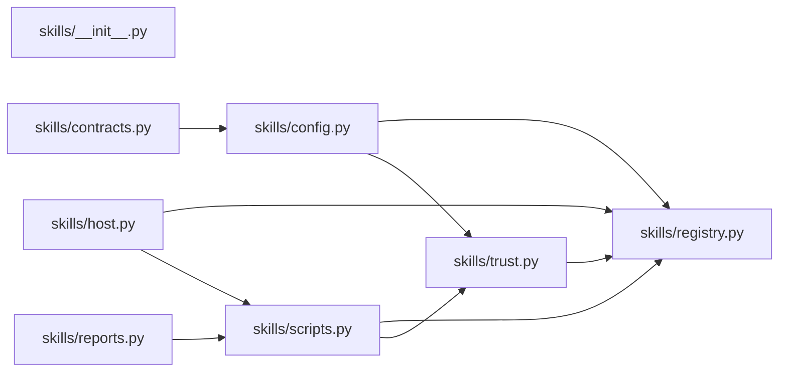
```mermaid
flowchart LR
  f0["skills/__init__.py"]
  f1["skills/config.py"]
  f2["skills/contracts.py"]
  f3["skills/host.py"]
  f4["skills/registry.py"]
  f5["skills/reports.py"]
  f6["skills/scripts.py"]
  f7["skills/trust.py"]
  f1 --> f4
  f1 --> f7
  f2 --> f1
  f3 --> f4
  f3 --> f6
  f5 --> f6
  f6 --> f4
  f6 --> f7
  f7 --> f4
```

### tools

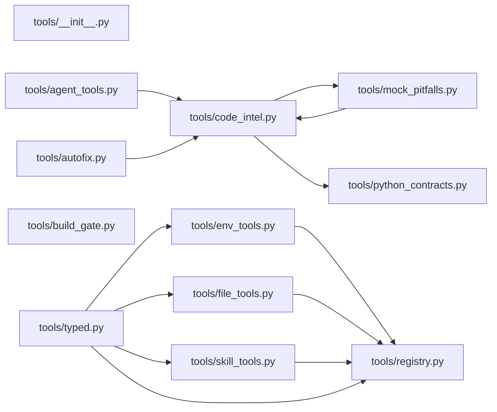
```mermaid
flowchart LR
  f0["tools/__init__.py"]
  f1["tools/agent_tools.py"]
  f2["tools/autofix.py"]
  f3["tools/build_gate.py"]
  f4["tools/code_intel.py"]
  f5["tools/env_tools.py"]
  f6["tools/file_tools.py"]
  f7["tools/mock_pitfalls.py"]
  f8["tools/python_contracts.py"]
  f9["tools/registry.py"]
  f10["tools/skill_tools.py"]
  f11["tools/typed.py"]
  f1 --> f4
  f2 --> f4
  f4 --> f7
  f4 --> f8
  f5 --> f9
  f6 --> f9
  f7 --> f4
  f10 --> f9
  f11 --> f5
  f11 --> f6
  f11 --> f9
  f11 --> f10
```

### ui

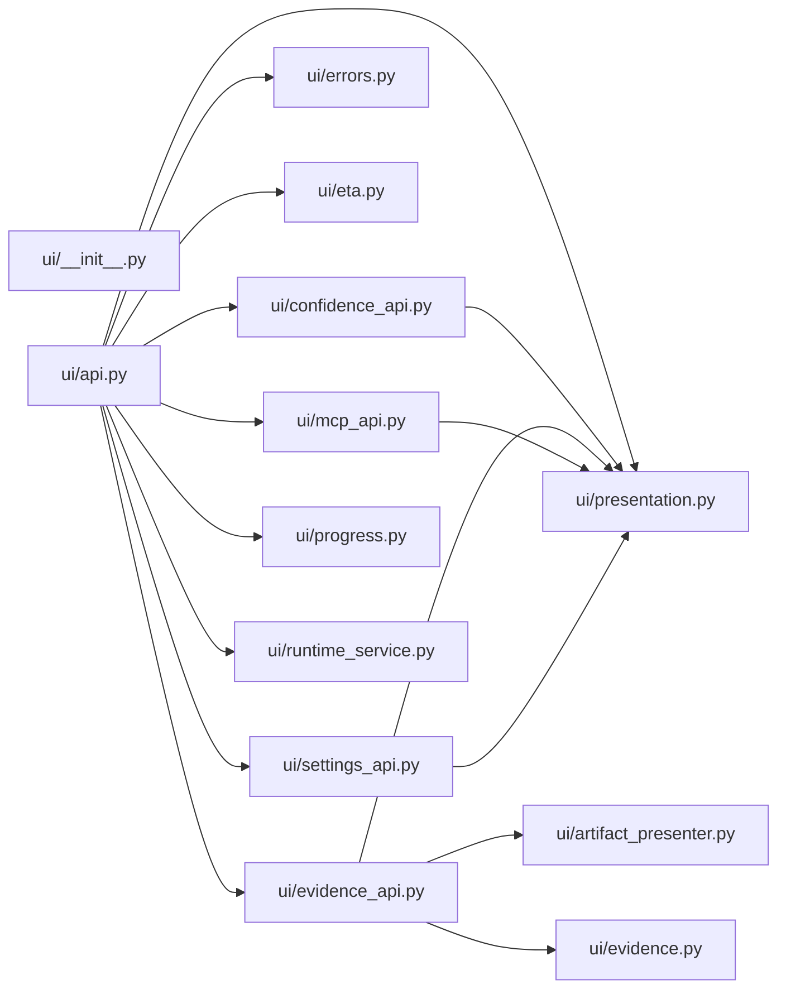
```mermaid
flowchart LR
  f0["ui/__init__.py"]
  f1["ui/api.py"]
  f2["ui/artifact_presenter.py"]
  f3["ui/confidence_api.py"]
  f4["ui/errors.py"]
  f5["ui/eta.py"]
  f6["ui/evidence.py"]
  f7["ui/evidence_api.py"]
  f8["ui/mcp_api.py"]
  f9["ui/presentation.py"]
  f10["ui/progress.py"]
  f11["ui/runtime_service.py"]
  f12["ui/settings_api.py"]
  f1 --> f3
  f1 --> f4
  f1 --> f5
  f1 --> f7
  f1 --> f8
  f1 --> f9
  f1 --> f10
  f1 --> f11
  f1 --> f12
  f3 --> f9
  f7 --> f2
  f7 --> f6
  f7 --> f9
  f8 --> f9
  f12 --> f9
```

### workflow_steps

```mermaid
flowchart LR
  f0["workflow_steps/__init__.py"]
  f1["workflow_steps/design.py"]
  f2["workflow_steps/design_review.py"]
  f3["workflow_steps/execution.py"]
  f4["workflow_steps/generation.py"]
  f5["workflow_steps/greenfield.py"]
  f6["workflow_steps/plan_review.py"]
  f7["workflow_steps/planning.py"]
  f8["workflow_steps/planning_batches.py"]
  f9["workflow_steps/rerun.py"]
  f10["workflow_steps/test_review.py"]
  f2 --> f5
  f4 --> f5
  f4 --> f10
  f6 --> f5
  f7 --> f1
  f7 --> f2
  f7 --> f6
  f7 --> f8
  f8 --> f1
  f10 --> f5
```

## 4. File table

| File | Description | Imports (internal) | Imported by |
|---|---|---|---|
| `frontend/app/(workspace)/layout.tsx` | Exports: WorkspaceLayout | `frontend/components/shell.tsx` | — |
| `frontend/app/(workspace)/marketplace/layout.tsx` | Exports: Layout | `frontend/components/marketplace.tsx` | — |
| `frontend/app/(workspace)/marketplace/mcp/[name]/page.tsx` | Exports: Page | `frontend/components/mcp-server.tsx` | — |
| `frontend/app/(workspace)/marketplace/mcp/new/page.tsx` | Exports: Page | `frontend/components/mcp-add.tsx` | — |
| `frontend/app/(workspace)/marketplace/mcp/page.tsx` | Exports: Page | `frontend/components/mcp-servers.tsx` | — |
| `frontend/app/(workspace)/marketplace/skills/[name]/page.tsx` | Exports: Page | `frontend/components/skills.tsx` | — |
| `frontend/app/(workspace)/marketplace/skills/page.tsx` | Exports: Page | `frontend/components/skills.tsx` | — |
| `frontend/app/(workspace)/prompts/page.tsx` | Exports: Page | `frontend/components/prompts.tsx` | — |
| `frontend/app/(workspace)/runs/[id]/artifacts/[stage]/[section]/page.tsx` | Exports: Page | — | — |
| `frontend/app/(workspace)/runs/[id]/artifacts/[stage]/page.tsx` | Exports: Page | — | — |
| `frontend/app/(workspace)/runs/[id]/artifacts/page.tsx` | Exports: Page | — | — |
| `frontend/app/(workspace)/runs/[id]/audit/page.tsx` | Exports: Page | — | — |
| `frontend/app/(workspace)/runs/[id]/errors/page.tsx` | Exports: Page | — | — |
| `frontend/app/(workspace)/runs/[id]/evidence/page.tsx` | Exports: Page | — | — |
| `frontend/app/(workspace)/runs/[id]/layout.tsx` | Exports: Layout | `frontend/components/run-shell.tsx` | — |
| `frontend/app/(workspace)/runs/[id]/logs/[fileId]/page.tsx` | Exports: Page | — | — |
| `frontend/app/(workspace)/runs/[id]/logs/page.tsx` | Exports: Page | — | — |
| `frontend/app/(workspace)/runs/[id]/observability/page.tsx` | Exports: Page | `frontend/components/observability.tsx` | — |
| `frontend/app/(workspace)/runs/[id]/page.tsx` | Exports: Page | — | — |
| `frontend/app/(workspace)/runs/[id]/prompts/page.tsx` | Exports: Page | — | — |
| `frontend/app/(workspace)/runs/[id]/qa/page.tsx` | Exports: Page | — | — |
| `frontend/app/(workspace)/runs/[id]/qa/steps/[step]/page.tsx` | Exports: Page | — | — |
| `frontend/app/(workspace)/runs/[id]/records/[kind]/[recordId]/page.tsx` | Exports: Page | — | — |
| `frontend/app/(workspace)/runs/[id]/tests/[file]/page.tsx` | Exports: Page | — | — |
| `frontend/app/(workspace)/runs/[id]/tests/page.tsx` | Exports: Page | — | — |
| `frontend/app/(workspace)/runs/new/page.tsx` | Exports: Page | — | — |
| `frontend/app/(workspace)/runs/page.tsx` | Exports: Page | — | — |
| `frontend/app/(workspace)/settings/page.tsx` | Exports: Page | — | — |
| `frontend/app/api/harness/[...path]/route.ts` | Exports: dynamic | `frontend/lib/backend.ts`, `frontend/lib/session.ts` | — |
| `frontend/app/api/harness/report/[token]/[...path]/route.ts` | Exports: dynamic | `frontend/lib/backend.ts`, `frontend/lib/report-token.ts`, `frontend/lib/session.ts` | — |
| `frontend/app/api/report-token/[runId]/route.ts` | Exports: dynamic, GET | `frontend/lib/report-token.ts`, `frontend/lib/session.ts` | — |
| `frontend/app/api/session/route.ts` | Exports: dynamic, GET | `frontend/lib/session.ts` | — |
| `frontend/app/layout.tsx` | Exports: metadata, RootLayout | — | — |
| `frontend/app/page.tsx` | Exports: Page | — | — |
| `frontend/components/data.tsx` | Exports: ResizeHandle, usePreference, useReturnFocus, Panel | `frontend/components/page.tsx` | `frontend/components/model-settings.tsx`, `frontend/components/prompts.tsx`, `frontend/components/shell.tsx` |
| `frontend/components/icons.tsx` | Exports: IconName, Icon | — | `frontend/components/marketplace.tsx`, `frontend/components/mcp-servers.tsx`, `frontend/components/observability.tsx`, `frontend/components/run-shell.tsx`, `frontend/components/shell.tsx`, `frontend/components/skills.tsx` |
| `frontend/components/markdown.tsx` | Exports: Markdown | — | `frontend/components/skills.tsx` |
| `frontend/components/marketplace.tsx` | Exports: MarketplaceLayout | `frontend/components/icons.tsx`, `frontend/lib/leave-guard.ts` | `frontend/app/(workspace)/marketplace/layout.tsx` |
| `frontend/components/mcp-add.tsx` | Exports: AddServer | `frontend/components/mcp-servers.tsx`, `frontend/components/page.tsx`, `frontend/lib/harness.ts`, `frontend/lib/leave-guard.ts` | `frontend/app/(workspace)/marketplace/mcp/new/page.tsx` |
| `frontend/components/mcp-server.tsx` | Exports: McpServerPage | `frontend/components/mcp-servers.tsx`, `frontend/components/page.tsx`, `frontend/lib/harness.ts`, `frontend/lib/leave-guard.ts` | `frontend/app/(workspace)/marketplace/mcp/[name]/page.tsx` |
| `frontend/components/mcp-servers.tsx` | Exports: Tool, Server, Budget, Preset, McpData, Desktop, … | `frontend/components/icons.tsx`, `frontend/components/page.tsx`, `frontend/lib/harness.ts`, `frontend/lib/leave-guard.ts` | `frontend/app/(workspace)/marketplace/mcp/page.tsx`, `frontend/components/mcp-add.tsx`, `frontend/components/mcp-server.tsx` |
| `frontend/components/model-settings.tsx` | Exports: baseUrlProblem, ModelSettings | `frontend/components/data.tsx`, `frontend/lib/harness.ts` | — |
| `frontend/components/observability.tsx` | Exports: ObservabilityView, ObservabilityReport | `frontend/components/icons.tsx`, `frontend/components/page.tsx`, `frontend/components/run-shell.tsx`, `frontend/lib/harness.ts` | `frontend/app/(workspace)/runs/[id]/observability/page.tsx` |
| `frontend/components/page.tsx` | Exports: RunScope, useRunId, recordHref, kindOf, StatusBadge, Metrics, … | `frontend/lib/harness.ts` | `frontend/components/data.tsx`, `frontend/components/mcp-add.tsx`, `frontend/components/mcp-server.tsx`, `frontend/components/mcp-servers.tsx`, `frontend/components/observability.tsx`, `frontend/components/prompts.tsx`, `frontend/components/run-shell.tsx`, `frontend/components/skills.tsx` |
| `frontend/components/prompts.tsx` | Exports: Prompts | `frontend/components/data.tsx`, `frontend/components/page.tsx`, `frontend/lib/harness.ts` | `frontend/app/(workspace)/prompts/page.tsx` |
| `frontend/components/run-shell.tsx` | Exports: STAGES, RUN_TABS, RUN_ID, useRun, RunLayout | `frontend/components/icons.tsx`, `frontend/components/page.tsx`, `frontend/components/shell.tsx`, `frontend/lib/harness.ts` | `frontend/app/(workspace)/runs/[id]/layout.tsx`, `frontend/components/observability.tsx` |
| `frontend/components/shell.tsx` | Exports: useShell, POLL_BUSY_MS, POLL_IDLE_MS, Shell | `frontend/components/data.tsx`, `frontend/components/icons.tsx`, `frontend/lib/harness.ts`, `frontend/lib/leave-guard.ts` | `frontend/app/(workspace)/layout.tsx`, `frontend/components/run-shell.tsx` |
| `frontend/components/skills.tsx` | Exports: Skills, SkillDetail | `frontend/components/icons.tsx`, `frontend/components/markdown.tsx`, `frontend/components/page.tsx`, `frontend/lib/harness.ts` | `frontend/app/(workspace)/marketplace/skills/[name]/page.tsx`, `frontend/app/(workspace)/marketplace/skills/page.tsx` |
| `frontend/lib/backend.ts` | Server-only: relays one request to the local Python API with its bearer token. Callers check the caller first. | — | `frontend/app/api/harness/[...path]/route.ts`, `frontend/app/api/harness/report/[token]/[...path]/route.ts` |
| `frontend/lib/csp.ts` | Server-only: the Content-Security-Policy for every UI document (launcher and desktop alike). | — | — |
| `frontend/lib/harness.ts` | Exports: Row, Pending, Run, RunSummary, Config, record, … | — | `frontend/components/mcp-add.tsx`, `frontend/components/mcp-server.tsx`, `frontend/components/mcp-servers.tsx`, `frontend/components/model-settings.tsx`, `frontend/components/observability.tsx`, `frontend/components/page.tsx`, `frontend/components/prompts.tsx`, `frontend/components/run-shell.tsx`, `frontend/components/shell.tsx`, `frontend/components/skills.tsx` |
| `frontend/lib/leave-guard.ts` | One unsaved-changes guard at a time (an open MCP server page). Navigation that would leave the page asks first. | — | `frontend/components/marketplace.tsx`, `frontend/components/mcp-add.tsx`, `frontend/components/mcp-server.tsx`, `frontend/components/mcp-servers.tsx`, `frontend/components/shell.tsx` |
| `frontend/lib/report-token.ts` | Server-only: capability tokens for report files. A sandboxed report frame (opaque origin) cannot send the session | `frontend/lib/session.ts` | `frontend/app/api/harness/report/[token]/[...path]/route.ts`, `frontend/app/api/report-token/[runId]/route.ts` |
| `frontend/lib/report.ts` |  | — | — |
| `frontend/lib/session.ts` | Server-only: browser sessions for the local UI. Import from route handlers and proxy.ts only. | — | `frontend/app/api/harness/[...path]/route.ts`, `frontend/app/api/harness/report/[token]/[...path]/route.ts`, `frontend/app/api/report-token/[runId]/route.ts`, `frontend/app/api/session/route.ts`, `frontend/lib/report-token.ts` |
| `scripts/benchmark_generation.py` | Score submitted pytest suites against source-backed targets and seeded defects. | `envs/execution.py` | — |
| `scripts/build_desktop.py` | Build the desktop installer: PyInstaller backend, Next.js standalone frontend, electron-builder. | — | — |
| `scripts/check_all.py` | Run the merge gate (CLAUDE.md, "Gate before merge") in order and print one summary. | — | — |
| `scripts/check_version.py` | Fail when the release version disagrees across the six version files, or a git tag does not match it. | — | — |
| `scripts/desktop_smoke.py` | Launch the packaged desktop installer and check that the app really starts. | — | — |
| `scripts/gen_architecture.py` | Generate docs/ARCHITECTURE_MAP.md: project flow, import graphs and a per-file table. | — | — |
| `scripts/json_to_markdown.py` | Convert a saved harness JSON artifact into Markdown. | `ui/artifact_presenter.py` | — |
| `scripts/secrets_scan.py` | Fail when a credential-shaped string is in the repository tree: provider keys (sk-, gh*_), AWS access key ids, | — | — |
| `scripts/start_ui.py` | Start the local Python API and Next.js together on Windows, macOS or Linux. | `envs/platform_compat.py`, `settings.py` | `start-macos.command`, `start-windows.cmd` |
| `scripts/vendor_skills.py` | Vendor selected Agent Skills from an upstream skills repository and write ``skills/SKILLS.lock.json``. | — | — |
| `skills/api-contract-analyzer/SKILL.md` | Extract normalized API contracts from OpenAPI 3.x, Swagger 2.0, or JSON Schema inputs for downstream test design, coverage, and traceability. Use whe… | `skills/config.py` | — |
| `skills/coverage-analyzer/SKILL.md` | Analyze evidence-based test coverage and identify actionable gaps by comparing traceable test cases with requirements, validation rules, and optional… | `skills/config.py` | — |
| `skills/generic-test-generator/SKILL.md` | Generate executable, traceable automated tests for any language from approved test-design cases, without running code or installing dependencies. Use… | `skills/config.py` | — |
| `skills/junit-generator/SKILL.md` | Generate executable Java tests in the repository’s declared JUnit version from approved test cases and source-backed fixtures. Use for JUnit 4 or 5 t… | `skills/config.py` | — |
| `skills/playwright-test-generator/SKILL.md` | Generate Playwright TypeScript UI and API automation (.spec.ts) from structured test cases, fixtures and API contracts. Use for approved ui/e2e/api c… | `skills/config.py` | — |
| `skills/repository-requirements/SKILL.md` | Infer testable requirements from an existing repository using bounded static evidence, for any programming language. Use in autonomous reverse-engine… | `skills/config.py` | — |
| `skills/requirement-analysis/SKILL.md` | Build bounded source-linked requirements from deterministic repository facts, with stable host IDs and explicit gaps, without a requirements model ca… | `skills/config.py` | — |
| `skills/reverse-engineering/SKILL.md` | Deterministically inventory source declarations from an approved local clone with bounded, contained reads, source hashes, evidence lines and explici… | `skills/config.py` | — |
| `skills/spec-authoring/SKILL.md` | Turn parsed requirement documents and Jira stories into structured specs (narrative, acceptance criteria, business rules, data examples), each tied t… | `skills/config.py` | — |
| `skills/test-data-generator/SKILL.md` | Generate deterministic test-data fixtures and payloads from test cases, validation rules, and API contracts. Use when test cases have been designed a… | `skills/config.py` | — |
| `skills/test-design-generator/SKILL.md` | Generate structured, deterministic test cases from analyzed requirements, acceptance criteria, validation rules, and optional API contracts. Use afte… | `skills/config.py` | — |
| `skills/test-planning/SKILL.md` | Build an evidence-based test strategy for a repository after deterministic analysis shows tests are missing. Use before test design to choose test le… | `skills/config.py` | — |
| `skills/test-reviewer/SKILL.md` | Independently review generated tests against the repository implementation. Use when the host asks for a test review. Score the rubric, derive the va… | `skills/config.py` | — |
| `skills/traceability-generator/SKILL.md` | Generate a requirement-to-test traceability matrix and gap report from requirements, test cases, traceability links, and generated artifacts. Use whe… | `skills/config.py` | — |
| `src/maf_test_harness/__init__.py` | MAF Test Harness: human-approved, evidence-driven test engineering on Microsoft Agent Framework. | `models.py` | — |
| `src/maf_test_harness/agent/__init__.py` | Model runtime: MAF agent construction, tool-trace middleware, budget guard, personas. | — | — |
| `src/maf_test_harness/agent/diagnosis.py` | The diagnosis agent: an LLM helper for failures the deterministic recovery could not resolve. | `agent/runtime.py`, `llm/prompts.py` | `workflow_steps/execution.py` |
| `src/maf_test_harness/agent/personas.py` | Cross-language personas for the autonomous MAF test-engineering workflow. | — | `agent/prompt_settings.py`, `ui/settings_api.py`, `workflow.py`, `workflow_steps/design_review.py`, `workflow_steps/generation.py`, `workflow_steps/greenfield.py`, `workflow_steps/plan_review.py`, `workflow_steps/planning.py`, `workflow_steps/test_review.py` |
| `src/maf_test_harness/agent/prompt_settings.py` | User-owned prompt templates; snapshots never change historical model requests. | `agent/personas.py`, `paths.py`, `storage.py` | `ui/api.py`, `ui/settings_api.py`, `workflow.py`, `workflow_steps/planning.py` |
| `src/maf_test_harness/agent/runtime.py` | MAF harness adapter. Native sessions and approval contents are kept intact. | `envs/platform_compat.py`, `hooks/agent_hooks_bridge.py`, `hooks/builtin.py`, `hooks/maf_bridge.py`, `llm/usage.py`, `mcp_servers.py`, `monitoring/trace.py`, `paths.py`, `settings.py`, `skills/config.py`, `skills/registry.py`, `skills/scripts.py`, `skills/trust.py`, `storage.py`, `tools/agent_tools.py`, `tools/typed.py` | `agent/diagnosis.py`, `cli.py`, `ui/api.py`, `workflow_steps/design_review.py`, `workflow_steps/generation.py`, `workflow_steps/greenfield.py`, `workflow_steps/plan_review.py`, `workflow_steps/planning.py`, `workflow_steps/test_review.py` |
| `src/maf_test_harness/cli.py` | Headless driver for the same checkpointed MAF workflow the Next.js UI uses. | `agent/runtime.py`, `envs/platform_compat.py`, `llm/usage.py`, `monitoring/report.py`, `paths.py`, `settings.py`, `skills/config.py`, `skills/registry.py`, `storage.py`, `workflow.py` | `desktop_backend.py` |
| `src/maf_test_harness/desktop_backend.py` | Entry point of the bundled desktop backend (``maf-backend``). | `cli.py`, `paths.py`, `qa/step_reports.py`, `repo/requirements.py`, `skills/scripts.py`, `ui/api.py` | — |
| `src/maf_test_harness/envs/__init__.py` | Per-language environment adapters and toolchain provisioning (see docs/ENVIRONMENTS.md). | `envs/spec.py`, `envs/toolchains.py` | `envs/environment.py`, `tools/env_tools.py`, `workflow_steps/execution.py`, `workflow_steps/generation.py` |
| `src/maf_test_harness/envs/app_launcher.py` | Start the application under test for the duration of an approved run, so UI/E2E (Playwright) cases can execute. | `envs/execution.py`, `envs/platform_compat.py`, `envs/runners.py` | `tools/agent_tools.py`, `workflow.py`, `workflow_steps/execution.py`, `workflow_steps/rerun.py` |
| `src/maf_test_harness/envs/env_check.py` | Which declared Python dependencies really are in the isolated environment, and which import errors follow. | `envs/platform_compat.py`, `envs/runners.py`, `repo/stack.py` | `envs/recovery.py`, `envs/runners.py`, `errors/engine.py`, `tools/agent_tools.py`, `tools/build_gate.py`, `tools/env_tools.py`, `workflow_steps/execution.py` |
| `src/maf_test_harness/envs/environment.py` | Environment plan: what must be installed to run this repository's tests, and how, in an isolated location. | `envs/__init__.py`, `envs/execution.py`, `envs/platform_compat.py`, `envs/runners.py`, `envs/toolchains.py`, `repo/stack.py` | `tools/code_intel.py`, `workflow_steps/execution.py`, `workflow_steps/planning.py` |
| `src/maf_test_harness/envs/execution.py` | Explicit local export/execution tools. A working copy is not a security sandbox. | `envs/platform_compat.py`, `repo/analyzer.py` | `scripts/benchmark_generation.py`, `envs/app_launcher.py`, `envs/environment.py`, `envs/runners.py`, `hooks/config.py`, `qa/packaging.py`, `repo/analyzer.py`, `skills/contracts.py`, `skills/scripts.py`, `tools/build_gate.py`, `workflow_steps/execution.py` |
| `src/maf_test_harness/envs/platform_compat.py` | OS-specific decisions for the isolated-environment pipeline, centralized so call sites stay uniform. | `envs/toolchains.py` | `scripts/start_ui.py`, `agent/runtime.py`, `cli.py`, `envs/app_launcher.py`, `envs/env_check.py`, `envs/environment.py`, `envs/execution.py`, `envs/recovery.py`, `envs/runners.py`, `envs/toolchains.py`, `hooks/engine.py`, `hooks/maf_bridge.py`, `repo/git_transport.py`, `repo/stack.py`, `tools/build_gate.py`, `tools/code_intel.py`, `ui/runtime_service.py`, `workflow.py`, `workflow_steps/design.py`, `workflow_steps/execution.py`, `workflow_steps/generation.py`, `workflow_steps/planning_batches.py` |
| `src/maf_test_harness/envs/python_env.py` | Python environments: which interpreter builds the venv, and what the project asks for. | `envs/spec.py` | — |
| `src/maf_test_harness/envs/recovery.py` | Bounded automatic recovery: turn a diagnosed setup failure into one allow-listed action, or say why not. | `envs/env_check.py`, `envs/platform_compat.py`, `envs/runners.py`, `envs/toolchains.py`, `errors/__init__.py` | `envs/runners.py`, `tools/env_tools.py`, `workflow.py`, `workflow_steps/execution.py` |
| `src/maf_test_harness/envs/regression.py` | Source-backed Maven regression scopes, separate from generated cases. | — | `envs/runners.py` |
| `src/maf_test_harness/envs/runners.py` | Per-ecosystem runner adapters: turn a StackProfile + generated files into an explicit, reviewable plan. | `envs/env_check.py`, `envs/execution.py`, `envs/platform_compat.py`, `envs/recovery.py`, `envs/regression.py`, `envs/spec.py`, `envs/toolchains.py`, `errors/__init__.py`, `paths.py`, `repo/analyzer.py`, `repo/stack.py`, `skills/contracts.py` | `envs/app_launcher.py`, `envs/env_check.py`, `envs/environment.py`, `envs/recovery.py`, `qa/report.py`, `tools/build_gate.py`, `workflow_steps/execution.py`, `workflow_steps/generation.py` |
| `src/maf_test_harness/envs/setup_guide.py` | Reviewable manual setup instructions; never executes pasted repository knowledge. | — | `workflow_steps/execution.py`, `workflow_steps/planning.py` |
| `src/maf_test_harness/envs/spec.py` | What toolchains a repository needs, read from its own files (no network, no model). | — | `envs/__init__.py`, `envs/python_env.py`, `envs/runners.py`, `envs/toolchains.py`, `tools/env_tools.py` |
| `src/maf_test_harness/envs/toolchains.py` | Find toolchains on the machine or provision them into a private cache, without touching the system. | `envs/platform_compat.py`, `envs/spec.py`, `paths.py` | `envs/__init__.py`, `envs/environment.py`, `envs/platform_compat.py`, `envs/recovery.py`, `envs/runners.py`, `tools/build_gate.py`, `tools/env_tools.py`, `workflow_steps/execution.py` |
| `src/maf_test_harness/errors/__init__.py` | Error taxonomy, classifiers and recovery playbook (see docs/ERROR_PLAYBOOK.md). | `errors/engine.py`, `errors/playbook.py`, `errors/taxonomy.py` | `envs/recovery.py`, `envs/runners.py`, `tools/build_gate.py`, `tools/env_tools.py` |
| `src/maf_test_harness/errors/classifiers/__init__.py` | Pattern tables per ecosystem. A rule is ``(error code, regular expression)``; order is priority (first match wins | `errors/classifiers/_compile.py`, `errors/classifiers/common.py`, `errors/classifiers/dotnet.py`, `errors/classifiers/java.py`, `errors/classifiers/python.py` | `errors/engine.py` |
| `src/maf_test_harness/errors/classifiers/_compile.py` | Shared helper to compile a pattern table. | — | `errors/classifiers/__init__.py`, `errors/classifiers/common.py`, `errors/classifiers/dotnet.py`, `errors/classifiers/java.py`, `errors/classifiers/python.py` |
| `src/maf_test_harness/errors/classifiers/common.py` | Errors that look the same in every ecosystem: machine, network, ports, browsers, permissions. | `errors/classifiers/_compile.py` | `errors/classifiers/__init__.py` |
| `src/maf_test_harness/errors/classifiers/dotnet.py` | .NET: SDK, NuGet restore, test host and compile/test failures. | `errors/classifiers/_compile.py` | `errors/classifiers/__init__.py` |
| `src/maf_test_harness/errors/classifiers/java.py` | Java (Maven and Gradle): toolchain, dependency resolution and compile/test failures. | `errors/classifiers/_compile.py` | `errors/classifiers/__init__.py` |
| `src/maf_test_harness/errors/classifiers/python.py` | Python: pip/venv failures and pytest execution failures. | `errors/classifiers/_compile.py` | `errors/classifiers/__init__.py` |
| `src/maf_test_harness/errors/engine.py` | Turn raw tool output into diagnoses: which known error it is, whose fault, and what may be done about it. | `envs/env_check.py`, `errors/classifiers/__init__.py`, `errors/taxonomy.py` | `errors/__init__.py` |
| `src/maf_test_harness/errors/playbook.py` | Recovery recipes: what each id in a diagnosis' ``recipes`` means, and whether it needs the human's consent. | `errors/taxonomy.py` | `errors/__init__.py` |
| `src/maf_test_harness/errors/taxonomy.py` | Every error the harness knows how to recognise: a stable code, who is at fault, and what may be done about it. | — | `errors/__init__.py`, `errors/engine.py`, `errors/playbook.py` |
| `src/maf_test_harness/hooks/__init__.py` | Hooks: user- and harness-defined checks that run before/after tool calls and model calls and at workflow events. | `hooks/config.py`, `hooks/engine.py`, `hooks/events.py` | `workflow.py`, `workflow_steps/execution.py` |
| `src/maf_test_harness/hooks/agent_hooks_bridge.py` | Run the harness hook engine as an AGENT-HOOKS-0.1 interceptor inside MAF's ``create_agent_hooks_middleware``. | `hooks/engine.py`, `hooks/events.py` | `agent/runtime.py` |
| `src/maf_test_harness/hooks/builtin.py` | Built-in hooks, on by default: secret redaction, write-scope guard, download consent, audit of gates and errors. | `hooks/engine.py`, `hooks/events.py`, `mcp_servers.py`, `settings.py` | `agent/runtime.py`, `hooks/config.py`, `monitoring/trace.py`, `qa/controls.py`, `qa/packaging.py`, `ui/api.py`, `ui/evidence.py`, `ui/presentation.py` |
| `src/maf_test_harness/hooks/config.py` | ``.harness/hooks.json``: load, validate and compile user hooks (plus the built-ins) into a ``HookEngine``. | `envs/execution.py`, `hooks/builtin.py`, `hooks/engine.py`, `hooks/events.py`, `paths.py` | `hooks/__init__.py`, `ui/settings_api.py` |
| `src/maf_test_harness/hooks/engine.py` | The hook engine: run every matching hook for an event and combine their verdicts, fail-closed. | `envs/platform_compat.py`, `hooks/events.py` | `hooks/__init__.py`, `hooks/agent_hooks_bridge.py`, `hooks/builtin.py`, `hooks/config.py`, `hooks/maf_bridge.py` |
| `src/maf_test_harness/hooks/events.py` | Hook events and verdicts: the vocabulary shared by every hook handler. | — | `hooks/__init__.py`, `hooks/agent_hooks_bridge.py`, `hooks/builtin.py`, `hooks/config.py`, `hooks/engine.py`, `hooks/maf_bridge.py` |
| `src/maf_test_harness/hooks/maf_bridge.py` | Run the hook engine inside MAF's agent loop as function and chat middleware. | `envs/platform_compat.py`, `hooks/engine.py`, `hooks/events.py` | `agent/runtime.py` |
| `src/maf_test_harness/llm/__init__.py` | Model-facing accounting: the daily token ledger. | — | — |
| `src/maf_test_harness/llm/prompts.py` | Prompt assembly for prefix caching. | — | `agent/diagnosis.py`, `workflow_steps/design_review.py`, `workflow_steps/generation.py`, `workflow_steps/greenfield.py`, `workflow_steps/plan_review.py`, `workflow_steps/planning.py`, `workflow_steps/test_review.py` |
| `src/maf_test_harness/llm/usage.py` | Daily token ledger: the harness's only spending limit. | `settings.py` | `agent/runtime.py`, `cli.py`, `ui/settings_api.py` |
| `src/maf_test_harness/mcp_servers.py` | User-configured MCP servers (docs/MCP.md): config on disk, secrets only in memory/keychain, MAF tool construction. | `paths.py`, `storage.py`, `ui/presentation.py` | `agent/runtime.py`, `hooks/builtin.py`, `repo/specs.py`, `ui/mcp_api.py` |
| `src/maf_test_harness/models.py` | — | — | `__init__.py`, `repo/analyzer.py`, `repo/requirements.py`, `repo/specs.py`, `workflow_steps/design_review.py`, `workflow_steps/generation.py`, `workflow_steps/greenfield.py`, `workflow_steps/plan_review.py`, `workflow_steps/planning.py`, `workflow_steps/test_review.py` |
| `src/maf_test_harness/monitoring/__init__.py` | Run tracing, telemetry and the observability report / tab. | — | — |
| `src/maf_test_harness/monitoring/report.py` | Observability and traceability report for one run, rebuilt from what is on disk. | `monitoring/trace.py`, `paths.py`, `skills/config.py`, `skills/registry.py`, `tools/agent_tools.py`, `tools/typed.py` | `cli.py`, `ui/api.py`, `ui/evidence_api.py` |
| `src/maf_test_harness/monitoring/telemetry.py` | Optional OpenTelemetry export for the MAF spans the framework already emits. | — | `workflow.py` |
| `src/maf_test_harness/monitoring/trace.py` | Append-only run trace: which model runs, tool calls and skill loads happened, in order, with timing and tokens. | `hooks/builtin.py` | `agent/runtime.py`, `monitoring/report.py`, `skills/host.py`, `workflow.py` |
| `src/maf_test_harness/paths.py` | Single resolver for bundled (read-only) resources and per-user (writable) data. | — | `agent/prompt_settings.py`, `agent/runtime.py`, `cli.py`, `desktop_backend.py`, `envs/runners.py`, `envs/toolchains.py`, `hooks/config.py`, `mcp_servers.py`, `monitoring/report.py`, `settings.py`, `skills/config.py`, `skills/scripts.py`, `skills/trust.py`, `ui/api.py`, `ui/evidence_api.py` |
| `src/maf_test_harness/qa/__init__.py` | Verdict computation, files-to-update triage, ZIP packaging. | — | — |
| `src/maf_test_harness/qa/confidence.py` | Host-computed confidence for reviewed generated cases. | — | `qa/derivation.py`, `qa/report.py`, `workflow_steps/design_review.py`, `workflow_steps/generation.py`, `workflow_steps/plan_review.py`, `workflow_steps/planning.py`, `workflow_steps/test_review.py` |
| `src/maf_test_harness/qa/controls.py` | End-to-end traceability: host-assigned control IDs from the test plan to the final report. | `hooks/builtin.py`, `qa/report.py` | `qa/packaging.py`, `qa/report.py`, `workflow_steps/planning.py`, `workflow_steps/planning_batches.py` |
| `src/maf_test_harness/qa/derivation.py` | Deterministic expectation checks for generated Python tests. Static only: nothing is executed or evaluated. | `qa/confidence.py` | `workflow_steps/test_review.py` |
| `src/maf_test_harness/qa/ledger.py` | Confidence ledger: one JSON line per host-computed plan/design/test score in ``<run_dir>/confidence.jsonl``. | `storage.py` | `qa/packaging.py`, `qa/report.py`, `ui/confidence_api.py`, `workflow_steps/design_review.py`, `workflow_steps/execution.py`, `workflow_steps/plan_review.py`, `workflow_steps/planning_batches.py`, `workflow_steps/test_review.py` |
| `src/maf_test_harness/qa/packaging.py` | Deliverable ZIP: the complete repository with every generated test in place, plus the evidence that produced it. | `envs/execution.py`, `hooks/builtin.py`, `qa/controls.py`, `qa/ledger.py`, `qa/step_reports.py`, `ui/evidence.py` | `workflow.py` |
| `src/maf_test_harness/qa/quality.py` | Conservative source witnesses; these checks never claim measured behavior coverage. | `skills/contracts.py` | `workflow_steps/generation.py`, `workflow_steps/planning.py` |
| `src/maf_test_harness/qa/report.py` | Deterministic QA report: requirement -> approved case -> generated test -> executed result. | `envs/runners.py`, `qa/confidence.py`, `qa/controls.py`, `qa/ledger.py`, `qa/triage.py`, `settings.py` | `qa/controls.py`, `qa/step_reports.py`, `skills/reports.py`, `ui/evidence_api.py`, `workflow_steps/design_review.py`, `workflow_steps/execution.py`, `workflow_steps/generation.py`, `workflow_steps/planning.py` |
| `src/maf_test_harness/qa/step_reports.py` | Deterministic per-step Markdown reports filled from saved artifacts (no model, no clock, no randomness). | `qa/report.py` | `desktop_backend.py`, `qa/packaging.py`, `ui/evidence_api.py`, `workflow_steps/execution.py` |
| `src/maf_test_harness/qa/triage.py` | Failure triage: which files (and lines) to update, derived deterministically from execution evidence. | — | `qa/report.py`, `ui/errors.py`, `workflow_steps/execution.py`, `workflow_steps/generation.py` |
| `src/maf_test_harness/repo/__init__.py` | Repository cloning, static analysis, stack detection, route extraction. | — | — |
| `src/maf_test_harness/repo/analyzer.py` | Clone transport, static repository analysis, evidence builders and target-source extraction. | `envs/execution.py`, `models.py`, `repo/git_transport.py`, `skills/contracts.py` | `envs/execution.py`, `envs/runners.py`, `repo/preview.py`, `repo/stack.py`, `repo/testability.py`, `tools/code_intel.py`, `tools/file_tools.py`, `ui/api.py`, `workflow.py`, `workflow_steps/design_review.py`, `workflow_steps/generation.py`, `workflow_steps/planning.py`, `workflow_steps/test_review.py` |
| `src/maf_test_harness/repo/git_transport.py` | File-backed Git output, bounded process-tree lifetime and explicit cancellation. | `envs/platform_compat.py`, `storage.py` | `repo/analyzer.py`, `ui/api.py` |
| `src/maf_test_harness/repo/import_recipes.py` | Correct import recipes for Python targets that a plain dotted import cannot reach. | — | `skills/contracts.py`, `tools/autofix.py`, `workflow_steps/generation.py` |
| `src/maf_test_harness/repo/preview.py` | Read-only repository preview from the public GitHub REST API (no clone, no install, no execution). | `repo/analyzer.py` | `ui/api.py` |
| `src/maf_test_harness/repo/requirements.py` | Evidence-bound requirements from deterministic reverse-engineering facts. | `models.py` | `desktop_backend.py` |
| `src/maf_test_harness/repo/reverse_engineering.py` | Bounded deterministic source inventory adapted to the host's approved clone boundary. | — | — |
| `src/maf_test_harness/repo/routes.py` | Route inventory: the HTTP routes the code actually implements, extracted from source. | — | `workflow_steps/generation.py` |
| `src/maf_test_harness/repo/specs.py` | Greenfield intake: deterministic parsing of documents and Jira Cloud stories into sections, then specs -> requirements. | `mcp_servers.py`, `models.py`, `skills/contracts.py` | `workflow.py`, `workflow_steps/greenfield.py` |
| `src/maf_test_harness/repo/stack.py` | Deterministic technology-stack profile used to pick a runner and to steer generation. | `envs/platform_compat.py`, `repo/analyzer.py` | `envs/env_check.py`, `envs/environment.py`, `envs/runners.py`, `tools/build_gate.py`, `tools/env_tools.py`, `workflow.py`, `workflow_steps/execution.py`, `workflow_steps/generation.py`, `workflow_steps/greenfield.py`, `workflow_steps/planning.py` |
| `src/maf_test_harness/repo/testability.py` | Deterministic, regex-based testability analysis (no model calls, bounded reads). | `repo/analyzer.py` | `workflow.py`, `workflow_steps/generation.py`, `workflow_steps/planning.py` |
| `src/maf_test_harness/run_options.py` | Run options: mode (brownfield/greenfield), test types (unit/integration), greenfield spec sources. | — | `ui/api.py`, `workflow_steps/planning.py` |
| `src/maf_test_harness/settings.py` | Single-source runtime settings for the MAF test harness. | `paths.py` | `scripts/start_ui.py`, `agent/runtime.py`, `cli.py`, `hooks/builtin.py`, `llm/usage.py`, `qa/report.py`, `ui/api.py`, `ui/settings_api.py`, `workflow.py`, `workflow_steps/design_review.py`, `workflow_steps/execution.py`, `workflow_steps/generation.py`, `workflow_steps/plan_review.py`, `workflow_steps/planning.py`, `workflow_steps/test_review.py`, `workflow_support.py` |
| `src/maf_test_harness/skills/__init__.py` | Agent Skills loading, spec/lock validation, contract enforcement, reviewed script execution. | — | — |
| `src/maf_test_harness/skills/config.py` | Which Agent Skills each workflow stage loads, and why. | `paths.py`, `skills/registry.py`, `skills/trust.py` | `skills/api-contract-analyzer/SKILL.md`, `skills/coverage-analyzer/SKILL.md`, `skills/generic-test-generator/SKILL.md`, `skills/junit-generator/SKILL.md`, `skills/playwright-test-generator/SKILL.md`, `skills/repository-requirements/SKILL.md`, `skills/requirement-analysis/SKILL.md`, `skills/reverse-engineering/SKILL.md`, `skills/spec-authoring/SKILL.md`, `skills/test-data-generator/SKILL.md`, `skills/test-design-generator/SKILL.md`, `skills/test-planning/SKILL.md`, `skills/test-reviewer/SKILL.md`, `skills/traceability-generator/SKILL.md`, `agent/runtime.py`, `cli.py`, `monitoring/report.py`, `skills/contracts.py`, `workflow.py`, `workflow_steps/generation.py`, `workflow_steps/planning.py` |
| `src/maf_test_harness/skills/contracts.py` | Deterministic adapters around imported marketplace skill contracts. | `envs/execution.py`, `repo/import_recipes.py`, `skills/config.py` | `envs/runners.py`, `qa/quality.py`, `repo/analyzer.py`, `repo/specs.py`, `tools/code_intel.py`, `tools/python_contracts.py`, `workflow_steps/generation.py`, `workflow_steps/planning.py`, `workflow_support.py` |
| `src/maf_test_harness/skills/host.py` | Execute locked host skill entry points and persist truthful script evidence. | `monitoring/trace.py`, `skills/registry.py`, `skills/scripts.py` | `workflow.py`, `workflow_steps/planning.py` |
| `src/maf_test_harness/skills/registry.py` | Agent Skills specification lint and provenance for the bundled skill packages. | — | `agent/runtime.py`, `cli.py`, `monitoring/report.py`, `skills/config.py`, `skills/host.py`, `skills/scripts.py`, `skills/trust.py`, `ui/evidence_api.py` |
| `src/maf_test_harness/skills/reports.py` | QA outputs shaped by the vendored skills' contracts and checked by the skills' own validators. | `qa/report.py`, `skills/scripts.py` | `workflow_steps/execution.py` |
| `src/maf_test_harness/skills/scripts.py` | Execution of Agent Skill scripts under a reviewed allow-list. | `envs/execution.py`, `paths.py`, `skills/registry.py`, `skills/trust.py` | `agent/runtime.py`, `desktop_backend.py`, `skills/host.py`, `skills/reports.py`, `tools/skill_tools.py` |
| `src/maf_test_harness/skills/trust.py` | Trust policy for skill packages. | `paths.py`, `skills/registry.py`, `storage.py` | `agent/runtime.py`, `skills/config.py`, `skills/scripts.py`, `ui/evidence_api.py` |
| `src/maf_test_harness/storage.py` | UTF-8 state storage resilient to short Windows sharing/antivirus locks. | — | `agent/prompt_settings.py`, `agent/runtime.py`, `cli.py`, `mcp_servers.py`, `qa/ledger.py`, `repo/git_transport.py`, `skills/trust.py`, `ui/api.py`, `ui/evidence.py`, `ui/evidence_api.py`, `ui/settings_api.py`, `workflow.py`, `workflow_steps/planning.py`, `workflow_steps/rerun.py`, `workflow_support.py` |
| `src/maf_test_harness/tools/__init__.py` | Deterministic central tools the agents call instead of guessing. | — | — |
| `src/maf_test_harness/tools/agent_tools.py` | The central harness tools, exposed to any stage agent as MAF function tools. | `envs/app_launcher.py`, `envs/env_check.py`, `tools/code_intel.py` | `agent/runtime.py`, `monitoring/report.py`, `workflow.py` |
| `src/maf_test_harness/tools/autofix.py` | Mechanical repairs the host applies to generated tests before any model retry. | `repo/import_recipes.py`, `tools/code_intel.py` | `workflow_steps/generation.py` |
| `src/maf_test_harness/tools/build_gate.py` | Compile / collect generated tests in the prepared workspace, before a model round is spent on guessing. | `envs/env_check.py`, `envs/execution.py`, `envs/platform_compat.py`, `envs/runners.py`, `envs/toolchains.py`, `errors/__init__.py`, `repo/stack.py` | `workflow_steps/generation.py` |
| `src/maf_test_harness/tools/code_intel.py` | Central, deterministic code-intelligence tools shared by the host and by every agent. | `envs/environment.py`, `envs/platform_compat.py`, `repo/analyzer.py`, `skills/contracts.py`, `tools/mock_pitfalls.py`, `tools/python_contracts.py` | `tools/agent_tools.py`, `tools/autofix.py`, `tools/mock_pitfalls.py`, `workflow_steps/generation.py` |
| `src/maf_test_harness/tools/env_tools.py` | Environment and diagnosis tools: what the repository needs, what is missing, what an error means. | `envs/__init__.py`, `envs/env_check.py`, `envs/recovery.py`, `envs/spec.py`, `envs/toolchains.py`, `errors/__init__.py`, `repo/stack.py`, `tools/registry.py` | `tools/typed.py` |
| `src/maf_test_harness/tools/file_tools.py` | File tools with hard scopes: read only inside the repository/workspace, write only inside the writable roots. | `repo/analyzer.py`, `tools/registry.py` | `tools/typed.py` |
| `src/maf_test_harness/tools/mock_pitfalls.py` | Static checks for generated-test mistakes that only show up at run time, found on real runs. | `tools/code_intel.py` | `tools/code_intel.py` |
| `src/maf_test_harness/tools/python_contracts.py` | Conservative source-only checks for generated Python fixture contracts. | `skills/contracts.py` | `tools/code_intel.py` |
| `src/maf_test_harness/tools/registry.py` | Typed tool registry: every tool takes a validated argument object and returns the same ``ToolResult`` envelope. | — | `tools/env_tools.py`, `tools/file_tools.py`, `tools/skill_tools.py`, `tools/typed.py`, `workflow.py` |
| `src/maf_test_harness/tools/skill_tools.py` | ``check_skill_output``: let a stage agent run the reviewed validators of its own skills on a draft. | `skills/scripts.py`, `tools/registry.py` | `tools/typed.py` |
| `src/maf_test_harness/tools/typed.py` | The default typed-tool registry and which stages get which tools. | `tools/env_tools.py`, `tools/file_tools.py`, `tools/registry.py`, `tools/skill_tools.py` | `agent/runtime.py`, `monitoring/report.py`, `workflow.py` |
| `src/maf_test_harness/ui/__init__.py` | Loopback HTTP API and services used by the Next.js UI and the desktop shell. | — | — |
| `src/maf_test_harness/ui/api.py` | Loopback-only HTTP adapter. The existing Harness owns every workflow decision. | `agent/prompt_settings.py`, `agent/runtime.py`, `hooks/builtin.py`, `monitoring/report.py`, `paths.py`, `repo/analyzer.py`, `repo/git_transport.py`, `repo/preview.py`, `run_options.py`, `settings.py`, `storage.py`, `ui/confidence_api.py`, `ui/errors.py`, `ui/eta.py`, `ui/evidence_api.py`, `ui/mcp_api.py`, `ui/presentation.py`, `ui/progress.py`, `ui/runtime_service.py`, `ui/settings_api.py`, `workflow.py`, `workflow_support.py` | `desktop_backend.py` |
| `src/maf_test_harness/ui/artifact_presenter.py` | Artifact presentation helpers shared by the loopback API and export scripts. | — | `scripts/json_to_markdown.py`, `ui/evidence_api.py` |
| `src/maf_test_harness/ui/confidence_api.py` | Confidence ledger read API: ``GET runs/<id>/confidence`` pages through the run's score records. | `qa/ledger.py`, `ui/presentation.py` | `ui/api.py` |
| `src/maf_test_harness/ui/errors.py` | Collect every run error (generation, stage, build gate, quarantine, gates) into one flat list. | `qa/triage.py` | `ui/api.py` |
| `src/maf_test_harness/ui/eta.py` | Deterministic per-stage progress and ETA derived from a run's audit.jsonl and trace.jsonl. | `workflow_steps/design.py`, `workflow_steps/planning_batches.py`, `workflow_support.py` | `ui/api.py` |
| `src/maf_test_harness/ui/evidence.py` | Read-only, contained access to execution evidence; never serve target source or configuration. | `hooks/builtin.py`, `storage.py` | `qa/packaging.py`, `ui/evidence_api.py` |
| `src/maf_test_harness/ui/evidence_api.py` | Focused evidence api operations. | `monitoring/report.py`, `paths.py`, `qa/report.py`, `qa/step_reports.py`, `skills/registry.py`, `skills/trust.py`, `storage.py`, `ui/artifact_presenter.py`, `ui/evidence.py`, `ui/presentation.py` | `ui/api.py` |
| `src/maf_test_harness/ui/mcp_api.py` | MCP server settings API (docs/MCP.md). Secret values go in, never out. | `mcp_servers.py`, `ui/presentation.py` | `ui/api.py` |
| `src/maf_test_harness/ui/presentation.py` | Shared secret redaction at the UI presentation boundary. | `hooks/builtin.py` | `mcp_servers.py`, `ui/api.py`, `ui/confidence_api.py`, `ui/evidence_api.py`, `ui/mcp_api.py`, `ui/settings_api.py` |
| `src/maf_test_harness/ui/progress.py` | Approval milestones; workflow completion is separate from the test verdict. | — | `ui/api.py` |
| `src/maf_test_harness/ui/runtime_service.py` | One event loop per UI session; every MAF client lives and closes on it. | `envs/platform_compat.py` | `ui/api.py` |
| `src/maf_test_harness/ui/settings_api.py` | Focused settings api operations. | `agent/personas.py`, `agent/prompt_settings.py`, `hooks/config.py`, `llm/usage.py`, `settings.py`, `storage.py`, `ui/presentation.py`, `workflow.py` | `ui/api.py` |
| `src/maf_test_harness/workflow.py` | Checkpointed autonomous MAF workflow with one human review gate per stage. | `agent/personas.py`, `agent/prompt_settings.py`, `envs/app_launcher.py`, `envs/platform_compat.py`, `envs/recovery.py`, `hooks/__init__.py`, `monitoring/telemetry.py`, `monitoring/trace.py`, `qa/packaging.py`, `repo/analyzer.py`, `repo/specs.py`, `repo/stack.py`, `repo/testability.py`, `settings.py`, `skills/config.py`, `skills/host.py`, `storage.py`, `tools/agent_tools.py`, `tools/registry.py`, `tools/typed.py`, `workflow_steps/execution.py`, `workflow_steps/generation.py`, `workflow_steps/greenfield.py`, `workflow_steps/planning.py`, `workflow_steps/rerun.py`, `workflow_support.py` | `cli.py`, `ui/api.py`, `ui/settings_api.py` |
| `src/maf_test_harness/workflow_steps/__init__.py` | Focused workflow operations; Harness retains checkpoint and approval ownership. | — | — |
| `src/maf_test_harness/workflow_steps/design.py` | Component-batched design without dropping the approved requirement inventory. | `envs/platform_compat.py`, `workflow_support.py` | `ui/eta.py`, `workflow_steps/planning.py`, `workflow_steps/planning_batches.py` |
| `src/maf_test_harness/workflow_steps/design_review.py` | Confidence reviewer of recommended design cases: rubric points from the reviewer, host caps, a hard gate at 95. | `agent/personas.py`, `agent/runtime.py`, `llm/prompts.py`, `models.py`, `qa/confidence.py`, `qa/ledger.py`, `qa/report.py`, `repo/analyzer.py`, `settings.py`, `workflow_steps/greenfield.py`, `workflow_support.py` | `workflow_steps/planning.py` |
| `src/maf_test_harness/workflow_steps/execution.py` | Execution operations extracted from the checkpointed Harness. | `agent/diagnosis.py`, `envs/__init__.py`, `envs/app_launcher.py`, `envs/env_check.py`, `envs/environment.py`, `envs/execution.py`, `envs/platform_compat.py`, `envs/recovery.py`, `envs/runners.py`, `envs/setup_guide.py`, `envs/toolchains.py`, `hooks/__init__.py`, `qa/ledger.py`, `qa/report.py`, `qa/step_reports.py`, `qa/triage.py`, `repo/stack.py`, `settings.py`, `skills/reports.py`, `workflow_support.py` | `workflow.py` |
| `src/maf_test_harness/workflow_steps/generation.py` | Generation operations extracted from the checkpointed Harness. | `agent/personas.py`, `agent/runtime.py`, `envs/__init__.py`, `envs/platform_compat.py`, `envs/runners.py`, `llm/prompts.py`, `models.py`, `qa/confidence.py`, `qa/quality.py`, `qa/report.py`, `qa/triage.py`, `repo/analyzer.py`, `repo/import_recipes.py`, `repo/routes.py`, `repo/stack.py`, `repo/testability.py`, `settings.py`, `skills/config.py`, `skills/contracts.py`, `tools/autofix.py`, `tools/build_gate.py`, `tools/code_intel.py`, `workflow_steps/greenfield.py`, `workflow_steps/test_review.py`, `workflow_support.py` | `workflow.py` |
| `src/maf_test_harness/workflow_steps/greenfield.py` | Greenfield mode: specs from documents/Jira replace repository analysis; no repository means a scaffold, no execution. | `agent/personas.py`, `agent/runtime.py`, `llm/prompts.py`, `models.py`, `repo/specs.py`, `repo/stack.py`, `workflow_support.py` | `workflow.py`, `workflow_steps/design_review.py`, `workflow_steps/generation.py`, `workflow_steps/plan_review.py`, `workflow_steps/test_review.py` |
| `src/maf_test_harness/workflow_steps/plan_review.py` | Confidence reviewer of test planning areas: rubric points from the reviewer, host caps, a hard gate at 95. | `agent/personas.py`, `agent/runtime.py`, `llm/prompts.py`, `models.py`, `qa/confidence.py`, `qa/ledger.py`, `settings.py`, `workflow_steps/greenfield.py`, `workflow_support.py` | `workflow_steps/planning.py` |
| `src/maf_test_harness/workflow_steps/planning.py` | Planning operations extracted from the checkpointed Harness. | `agent/personas.py`, `agent/prompt_settings.py`, `agent/runtime.py`, `envs/environment.py`, `envs/setup_guide.py`, `llm/prompts.py`, `models.py`, `qa/confidence.py`, `qa/controls.py`, `qa/quality.py`, `qa/report.py`, `repo/analyzer.py`, `repo/stack.py`, `repo/testability.py`, `run_options.py`, `settings.py`, `skills/config.py`, `skills/contracts.py`, `skills/host.py`, `storage.py`, `workflow_steps/design.py`, `workflow_steps/design_review.py`, `workflow_steps/plan_review.py`, `workflow_steps/planning_batches.py`, `workflow_support.py` | `workflow.py` |
| `src/maf_test_harness/workflow_steps/planning_batches.py` | Component-batched test planning: one compact plan per requirement batch, merged deterministically. | `envs/platform_compat.py`, `qa/controls.py`, `qa/ledger.py`, `workflow_steps/design.py`, `workflow_support.py` | `ui/eta.py`, `workflow_steps/planning.py` |
| `src/maf_test_harness/workflow_steps/rerun.py` | Explicit stage replay with retained evidence and fresh workflow checkpoints. | `envs/app_launcher.py`, `storage.py`, `workflow_support.py` | `workflow.py` |
| `src/maf_test_harness/workflow_steps/test_review.py` | Independent MAF review of generated cases against their actual source evidence. | `agent/personas.py`, `agent/runtime.py`, `llm/prompts.py`, `models.py`, `qa/confidence.py`, `qa/derivation.py`, `qa/ledger.py`, `repo/analyzer.py`, `settings.py`, `workflow_steps/greenfield.py`, `workflow_support.py` | `workflow_steps/generation.py` |
| `src/maf_test_harness/workflow_support.py` | Shared workflow constants and artifact helpers. | `settings.py`, `skills/contracts.py`, `storage.py` | `ui/api.py`, `ui/eta.py`, `workflow.py`, `workflow_steps/design.py`, `workflow_steps/design_review.py`, `workflow_steps/execution.py`, `workflow_steps/generation.py`, `workflow_steps/greenfield.py`, `workflow_steps/plan_review.py`, `workflow_steps/planning.py`, `workflow_steps/planning_batches.py`, `workflow_steps/rerun.py`, `workflow_steps/test_review.py` |
| `start-linux.sh` | Launcher | `start-macos.command` | — |
| `start-macos.command` | Thin launcher; delegates to scripts/start_ui.py | `scripts/start_ui.py` | `start-linux.sh` |
| `start-windows.cmd` | Thin launcher; delegates to scripts/start_ui.py | `scripts/start_ui.py` | — |
